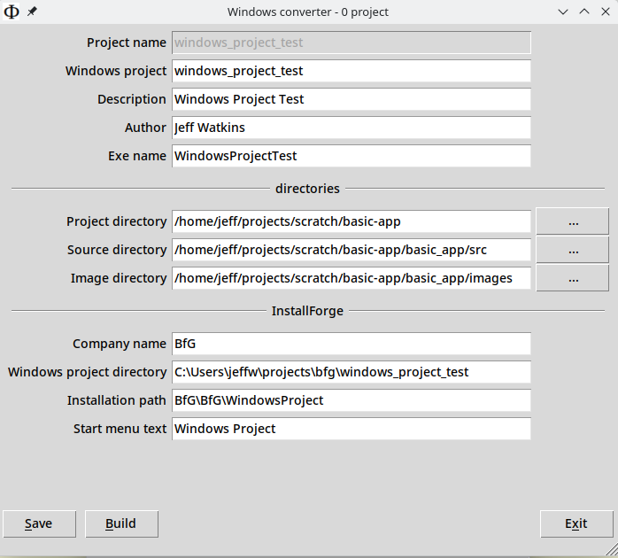

## Linux

### Structure

The project should have as a minimal structure

    <project name>
    ├── src
    │   ├── images
    │   │   ├── icon.ico
    │   │   └── icon.png
    │   └── <project name>
    │       └── _version.py
    └── tests
        └── test_version.py

The converter builds the structure required by Windows

The *image* directory needs both icons

### Converter

In *~/projects/scripts/windows-converter*

    python src/main.py

and build. This creates a copy of the application in *~/projects/windows-projects*

Ensure *requirements.txt* is in the *converted* directory ready for transfer to windows.

Zip the directory and make available.

## Windows

[See](application.html#python-apps-on-windows)
