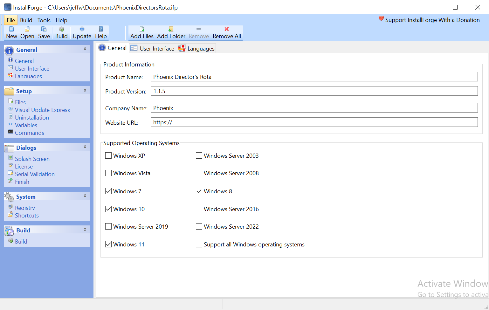
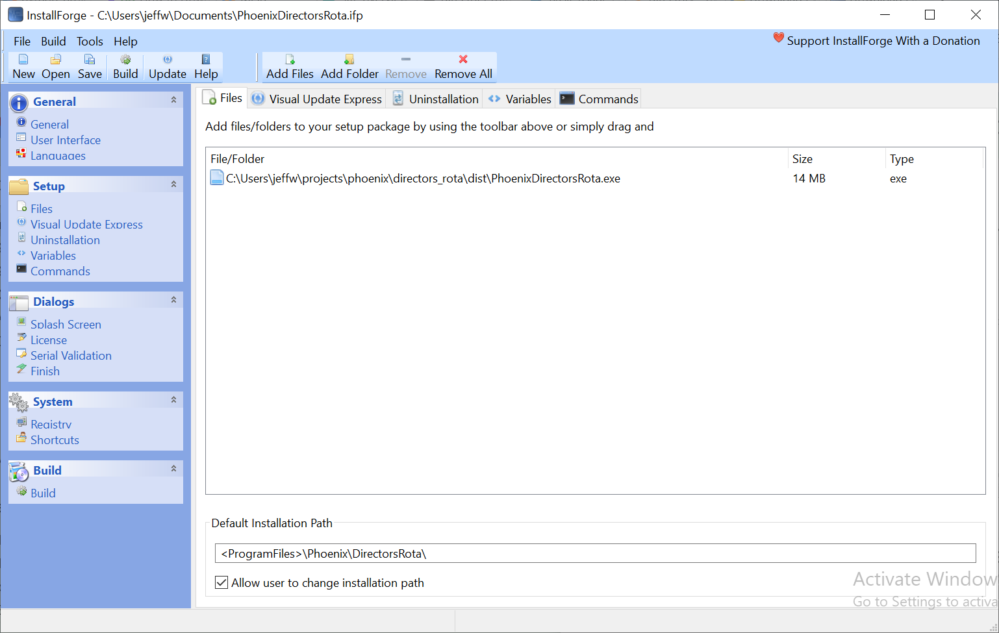
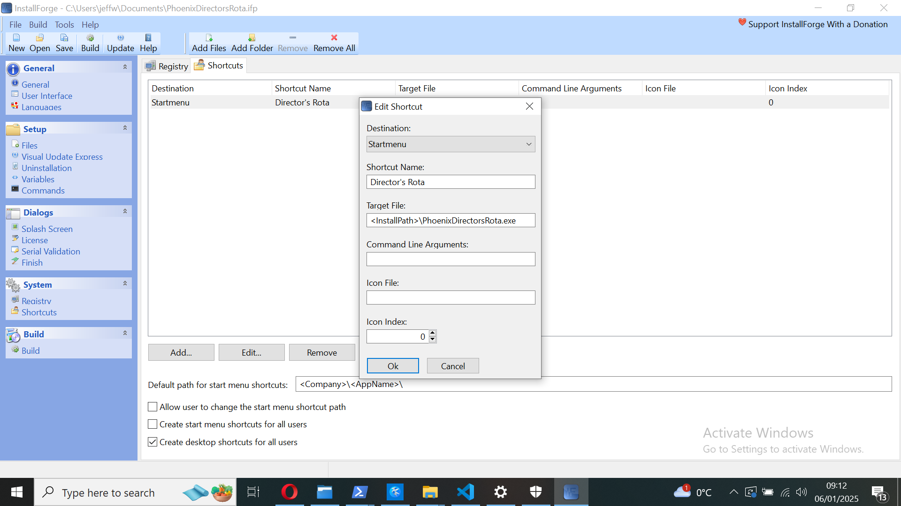

Create Windows ready code by using *windows-converter*. Ensure *requirements.txt* is up to date.

Zip directory and expand into appropriate directory on Windows computer. Open Konsole in base dir.

## Initialise uv

```bash
uv init
```

```bash
uv pip install -r requirements.txt
```

## Prepare and test

Use *justfile*

```bash
just run
```

```bash
just test
```

## Generate exe

```bash
just build
```

## Create a distributable file

(see [this page](https://www.pythonguis.com/tutorials/packaging-tkinter-applications-windows-pyinstaller/))

Install  and start [*InstallForge*](https://installforge.net/download/)

### General page



### Setup page

NB Create *setup* directory



### Shortcut page




### Build page


### Build

Click on *build* in the menubar. The build file is in the *setup* directory.

## Install

Install the exe and note the installation path. Place *.env* file here.
